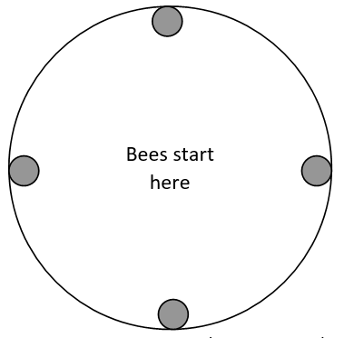

```{r setup, include=FALSE}
library(tidyverse)
library(tibble)
library(ggplot2)
knitr::opts_chunk$set(echo = TRUE)
```

## Introduction

Welcome to the "Burrowing Bees" assignment. 
Penny Kukuk, a biologist at UM, performed the following experiment. Four adult female bees of an 
Australian species that builds its hives underground (Lasioglossum hemichalceum) were placed in 
a circular container with a smooth uniform surface of dirt with four indentations placed at the 
edge of the circle 90 degrees apart.


The bees instinctively would burrow into the indentations (I’ll call the indentations “holes” for short). 
Sometimes more than one bee would burrow into the same hole leaving some holes empty. After all the bees 
had burrowed into the holes, the pattern of bee occupancy was observed. This experiment was repeated 
37 times with different bees each time.

```{r results-table}
res <- tibble(pattern=c("4,0,0,0","3,1,0,0","2,2,0,0","2,1,1,0","1,1,1,1"),
              count=c(4,4,5,17,7)) %>% 
  mutate(portion=count/sum(count))

knitr::kable(res,digits=3,colnames=c("Pattern","Count","Portion"))

```

The biologist was interested in whether the bees appear to choose holes independently of 
each other (the alternative is that they tend to either choose holes in which there already 
is a bee or tend to avoid holes in which there already is a bee or both). Therefore, we want 
to calculate the probability of each pattern if each bee chose a hole randomly and independently of the other bees.

Note that, as far as the biologist is concerned, the holes are indistinguishable and the bees 
are indistinguishable. For instance, the pattern “3,1,0,0” means that 3 bees ended up in one of 
the holes and 1 in another; the specific holes don't matter, nor do the specific bees. 

## Goal

Let’s use a simulation to estimate if the bees are behaving randomly. 
In order to do this, you will need to write code that simulates a 
certain number of trials (which can be user determined).

The following steps are a guideline; there are many ways to solve the problem:

1.	Set up a data frame to hold the results of your analysis. 
1.	Write a function that takes a vector of hole choices from the 
    bees and maps it onto our pattern. For instance, the vector c(3,3,3,3) 
    could indicate that all bees chose hole 3. 
    The vector c(4,1,2,4) could mean that bees 1 and 4 chose hole 4, bee 2 chose hole 1, and bee 3 chose hole 2. 
    You would need to map these to “4,0,0,0” and “2,1,1,0” respectively. 
1.	Set up a way to do the actual selection of holes. This is basically the "shuffling" 
from permutation testing. Check out `sample`.
1.	Record those values in your data frame and use those to estimate the proportions. 

Do steps 1-4 many times  and calculate the proportions of each outcome. Then compare that to the experimental results. 

Do the results of the experiment seem to the the result of chance? 

```{r}
final_props <- data.frame(
  "4,0,0,0" = double(), 
  "3,1,0,0" = double(),
  "2,2,0,0" = double(),
  "2,1,1,0" = double(),
  "1,1,1,1" = double()
)

trials = 1000

for (i in 1:trials){
# Initialize a an empty dataframe
results_df <- data.frame(
  trial = integer(),  
  pattern = character(), 
  mapped_pattern = character()  
)

# Counts number of bees in each hole
map_pattern <- function(choices) {
  mapped_pattern <- table(choices)
  mapped_pattern <- as.character(mapped_pattern[1:4])
  return(mapped_pattern)
}

# Uses random integers to indicate bee hole choices
select_holes <- function() {
  choices <- sample.int(4, 4, replace = TRUE)
  return(choices)
}

num_trials <- 37

# Simulate trials and record results
for (i in 1:num_trials) {
  choices <- select_holes()
  mapped_pattern <- map_pattern(choices)
  results_df <- rbind(results_df, data.frame(trial = i, pattern = paste(choices, collapse = ","), mapped_pattern = paste(mapped_pattern, collapse = ",")))
}

proportions <- table(results_df$mapped_pattern) / num_trials


# Convert proportions to same table as presented by researcher
sim_res <- tibble(pattern=c("4,0,0,0","3,1,0,0","2,2,0,0","2,1,1,0","1,1,1,1"),
              portion=c(proportions["4,NA,NA,NA"],
                      proportions["1,3,NA,NA"] + proportions["3,1,NA,NA"],
                      proportions["2,2,NA,NA"],
                      proportions["1,1,2,NA"] + proportions["1,2,1,NA"] + proportions["2,1,1,NA"],
                      proportions["1,1,1,1"]))


proportion_dist <- data.frame("4,0,0,0" = sim_res[1,2],
                              "3,1,0,0" = sim_res[2,2],
                              "2,2,0,0" = sim_res[3,2],
                              "2,1,1,0" = sim_res[4,2],
                              "1,1,1,1" = sim_res[5,2])

final_props <- rbind(final_props, proportion_dist)
}
```
The above code performs 1000 simulations of 37 trials each. In these simulated trials, bees choose holes completely at random, and their decisions are not influenced by the other bees. The results from this simulation represent the expected proportion of observed patterns that support our null hypothesis. The following code will compare these results to the results collected by the researcher. First let's look at the proportion of observations where all four bees burrowed in separate holes.

```{r}
#p-value for all bees in individual holes 
final_props[is.na(final_props)] <- 0
ones_actual <- 0.189
ones_mean <- mean(final_props$portion.4)
ones_sd <- sd(final_props$portion.4)

p1 = 1 - pnorm(ones_actual, ones_mean, ones_sd)

p1.2 = mean(final_props$portion.4 >= ones_actual)
# Appears as if the bees are choosing to go to empty holes more often than random
# Plot the results
# Generate x values for the curve
x <- seq(-0.1, 0.3, length.out = 1000)
# Calculate the normal density values
y <- dnorm(x, mean = ones_mean, sd = ones_sd)
# Create a data frame for the curve
curve_data <- data.frame(x = x, y = y)
# Visualize the data
ggplot(data = curve_data, aes(x = x, y = y)) +
  geom_line() +
  geom_vline(xintercept = ones_actual, color = "red") +
  labs(x = "Proportion of Observations", y = "Probability") +
  theme_minimal()
```

The above plot shows the distribution of the proportion of trials where a 1,1,1,1 pattern was observed. The red line indicated the observed proportion of this pattern by the researcher. Based on this simulation the average proportion of observations matching the (1,1,1,1) for all simulations was `r ones_mean`. This is lower than the actual proportion observed by the researcher, who found that all four bees burrowed in their own holes 'r ones_actual * 100'% of the time. Only `r sum(final_props$portion.4 >= ones_actual)` of the 1000 simulations resulted in greater than or equal to the proportion observed in the researchers experiment. Resulting in a p-value of `r p1`. This suggests that the bees might not be burrowing holes independently of each other, and prefer to burrow in holes that do not already have another bee in them. Let's explore this further.

```{r}
# Compare proportion of (2,2,0,0) observation
twos_actual <- 0.135
twos_mean <- mean(final_props$portion.2)
twos_sd <- sd(final_props$portion.2)

p22 = 1 - pnorm(twos_actual, twos_mean, twos_sd)

p22.2 = mean(final_props$portion.2 >= twos_actual)


# compare proportion of (2,1,1,0) observation
two_ones_actual <- 0.459
two_ones_mean <- mean(final_props$portion.3)
two_ones_sd <- sd(final_props$portion.3)

p211 = 1 - pnorm(two_ones_actual, two_ones_mean, two_ones_sd)

p211.2= mean(final_props$portion.3 >= two_ones_actual)
# Compare proportion of (3,1,0,0) observation
three_actual <- 0.135
three_mean <- mean(final_props$portion.1)
three_sd <- sd(final_props$portion.1)

p31 = 1 - pnorm(three_actual, three_mean, three_sd)


# Compare proportion of (4,0,0,0) observation
four_actual <- 0.135
four_mean <- mean(final_props$portion)
four_sd <- sd(final_props$portion)

p4 = 1 - pnorm(four_actual, four_mean, four_sd)
p4.2 = mean(final_props$portion >= four_actual)

# make Table
result_table <- tibble(
  Pattern = c("4,0,0,0", "3,1,0,0", "2,2,0,0", "2,1,1,0", "1,1,1,1"),
  Observed_Portion = c(4, 4, 5, 17, 7) / 37,
  Simulated_Portion = c(four_mean, three_mean, twos_mean, two_ones_mean, ones_mean),
  right_sided_p_value = c(p4, p31, p22, p211, p1)
)

knitr::kable(result_table,digits=4,colnames=c("Pattern","Observed Proportion","Simulated Proportion","Right-sided p-value"))
```

There appears to be an interesting pattern occurring. The bees in this experiment burrowed in a pattern of 1,1,1,1 and 4,0,0,0 far more often than observed in the simulation (p = `r p1` and `r p4` respectively). The bees also burrowed in the patterns of 3,1,0,0, 2,2,0,0 and 2,1,1,0 less often than observed in the simulation (p = `r 1-p31`, `r 1-p22`, and `r 1-p211` respectively). These results indicate that the bees do not appear to be choosing their holes independently of each other. Whether they prefer to burrow in holes with other bees, or holes without other bees remains unclear. These results appear to support a hypothesis where the bees prefer to either burrow together or independently, but not a mixture of the two. Perhaps they are responding to social cues from the other bees, and collectively agreeing to burrow together or independently. 


### Questions
I do not feel confident about the results of this analysis. Why might I be getting significance for both a higher proportion of 4,0,0,0 and 1,1,1,1? 

For the simulation, since the researcher performed 37 trials, should my simulation also use 37 trials and then whatever number of simulations I prefer? Or can I choose to use something like 100 trials?

Is it more appropriate to calculate the p-values using a normal distribution approximation function like pnorm, or since I simulated so many results, can I just calculate the proportion of simulations greater than or equal to the experiment proportions? (I did both in my work. p1 is the p-value for the 1,1,1,1 value using pnorm, and p1.2 is the same p-value but calculated using the proportion of observation more extreme than the observed result.)

Thanks!
